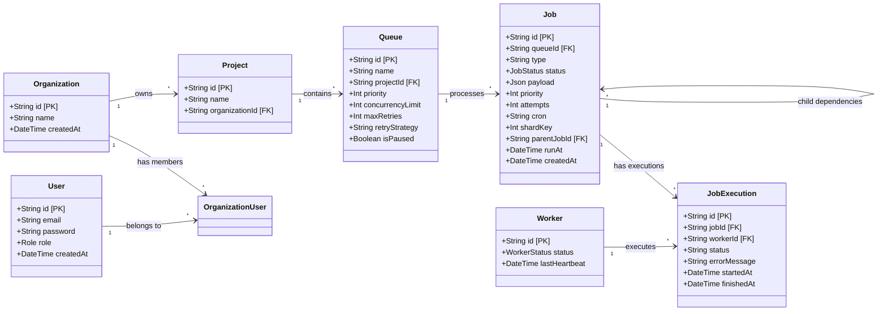

# Entity-Relationship (ER) Diagram

This diagram represents the core data models supporting our Job Scheduler architecture, including multi-tenant isolation (Organizations, Users), Sharding, and Workflow Dependencies (parentJob/childJobs).

