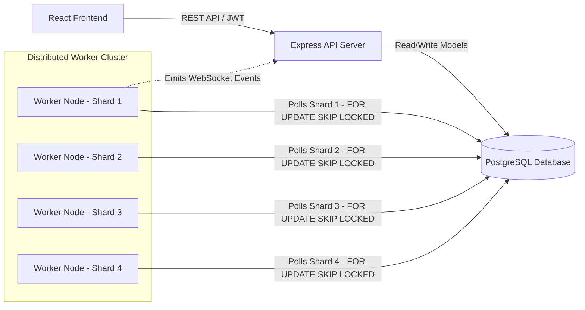

# System Architecture

The Job Scheduler is designed as a distributed, multi-tenant SaaS platform capable of executing background tasks reliably and scalably.

## Core Components

1. **Client / Frontend (React + Vite)**
   - Provides a real-time dashboard for managing queues and monitoring jobs.
   - Communicates with the backend via REST APIs.
   - Polls the `/api/jobs/stats` endpoint for multi-tenant isolated metrics.

2. **API Server (Express.js)**
   - Exposes RESTful endpoints for Job, Queue, and Auth management.
   - Handles JWT-based authentication and Role-Based Access Control (RBAC).
   - Enforces strict Multi-Tenant Data Isolation by scoping all queries to the user's `Organization`.

3. **Database (PostgreSQL via Prisma ORM)**
   - Stores the persistent state of Organizations, Users, Queues, Jobs, and Executions.
   - Handles complex hierarchical relations (e.g., Workflow Dependencies / Child Jobs).
   - Provides atomic concurrency control for distributed workers using row-level locking.

4. **Worker Nodes (Node.js)**
   - The system spins up **multiple independent worker shards** (currently 4).
   - Each worker only polls for jobs assigned to its specific `shardKey`.
   - Utilizes `FOR UPDATE SKIP LOCKED` in raw SQL to achieve Distributed Locking and prevent race conditions.
   - Responsible for executing jobs, managing exponential backoff retries, moving failures to the Dead Letter Queue (DLQ), and generating AI Failure Summaries.
   - Resolves DAG workflow dependencies by automatically queuing child jobs upon parent completion.

## Architecture Diagram

## Advanced Features Implemented
- **Queue Sharding:** Jobs are distributed across 4 distinct worker shards for horizontal scalability.
- **Distributed Locking:** Exactly-once execution guaranteed via DB-level row locks.
- **Multi-Tenancy:** Automated provisioning of Organization/Project infrastructure per user account.
- **Workflow Dependencies:** Support for parent-child job DAGs (`DEPENDENCY_WAITING`).
- **AI Error Summaries:** Synthesis of unhandled exception context in the DLQ.
- **Real-time Engine:** Backend powered by Socket.io for immediate UI updates.
