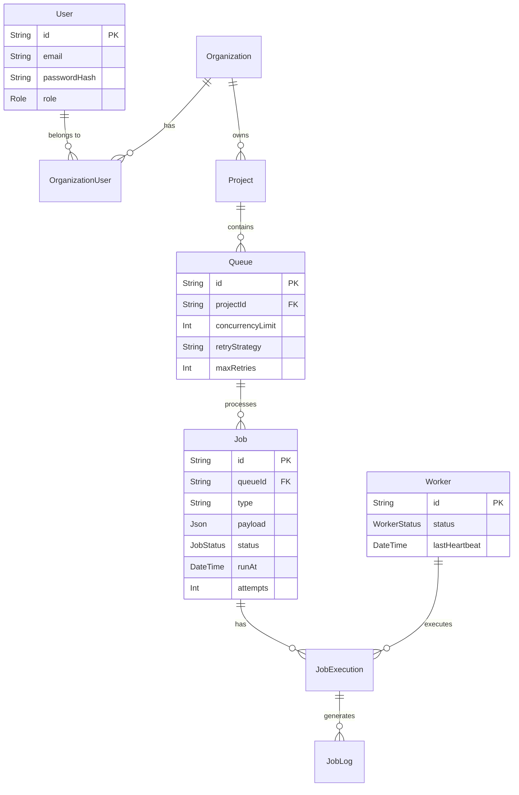

# Database Entity Relationship Diagram

## Key Considerations
- **Indexing:** Indexes on `Job(status, runAt, priority)` for extremely fast polling queries.
- **Normalization:** Proper relationships prevent data duplication. Deleting a queue cascades and deletes its jobs.
- **Concurrency Control:** `SELECT ... FOR UPDATE SKIP LOCKED` ensures jobs aren't claimed twice, leveraging PostgreSQL's robust MVCC and row-level locks.
